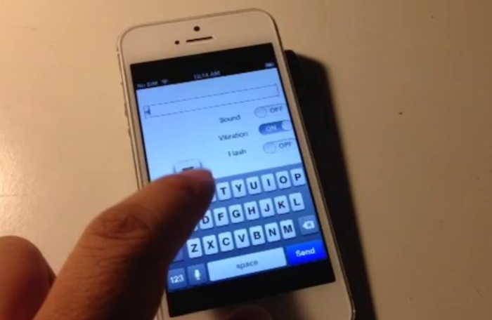

MorseCodeGenerator
==================

Simple app that converts ascii into morse code, with options to present the code with flashs and vibrations.

What it's really about: an excuse to mess with the private api AudioServicesPlaySystemSoundWithVibration to generate patterned vibrations. See http://stackoverflow.com/questions/12966467/are-there-apis-for-custom-vibrations-in-ios for details.

For details and demo video please refer to this post:

http://corgitoergosum.net/2013/08/22/fun-with-private-apis/

-- --- .-. .... .     -.-. --- -.. .     --. . -. . .-. .- - --- .-.

Note that the app was created in Xcode5 and would not open in Xcode4.
